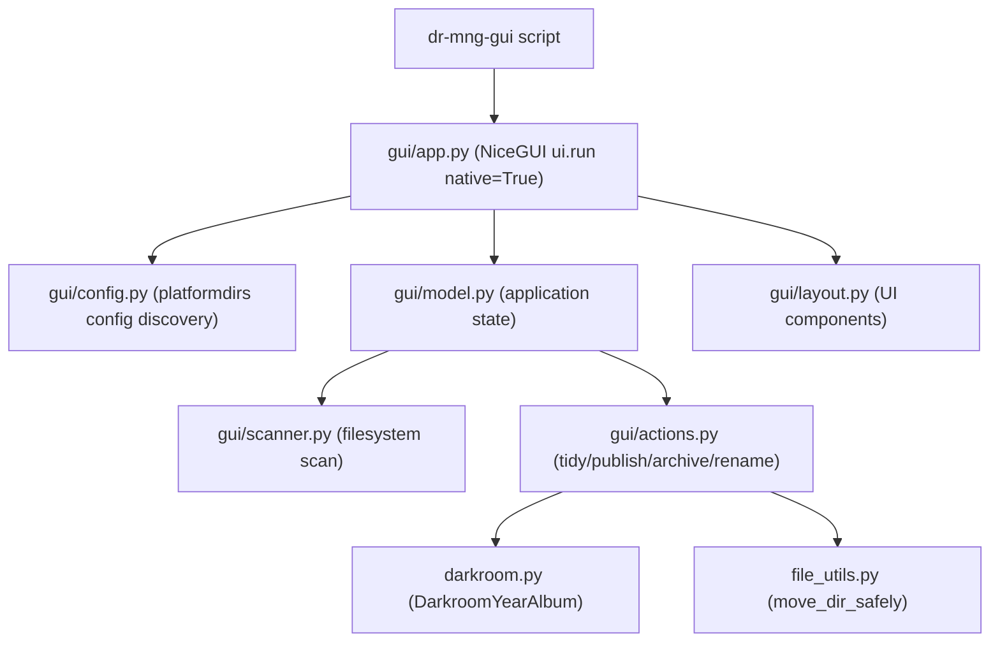

# Darkroom GUI Cockpit

## Current State

The project has a Typer CLI (`[cli.py](src/photo_darkroom_manager/cli.py)`) with five commands: `status`, `new-album`, `tidy`, `publish`, `archive`. Core models live in `[darkroom.py](src/photo_darkroom_manager/darkroom.py)` (`DarkroomYearAlbum`, `recognize_darkroom_album`), config in `[config.py](src/photo_darkroom_manager/config.py)` (`Settings` with `darkroom`/`showroom`/`archive` paths loaded from `darkroom.yaml`), and file operations in `[file_utils.py](src/photo_darkroom_manager/file_utils.py)`.

Business logic for `tidy`, `publish`, and `archive` is currently embedded in CLI handler functions alongside Rich/Typer presentation code, so it cannot be directly reused by the GUI.

## Architecture




## Module Structure

All new files go under `src/photo_darkroom_manager/gui/`:

- `**__init__.py**` -- package init
- `**config.py**` -- uses `platformdirs.user_config_path("photo-darkroom-manager")` to locate/create a `config.yaml`. On first launch (no config found), shows a setup dialog to configure paths. Reuses the existing `Settings` fields (`darkroom`, `showroom`, `archive`).
- `**model.py**` -- `AppModel` class that holds the full scanned darkroom tree, scan state (scanning/idle), and selected node. Provides methods to trigger rescan, and exposes reactive state for the UI.
- `**scanner.py**` -- `DarkroomScanner` that walks the darkroom directory and builds a tree of `DarkroomNode` dataclasses:

```python
  @dataclass
  class FolderStats:
      image_count: int
      video_count: int
      other_file_count: int

  @dataclass
  class DarkroomNode:
      path: Path
      name: str
      node_type: Literal["root", "year", "album", "subfolder"]
      stats: FolderStats
      issues: list[str]  # e.g. ["untidy"] when loose media files detected
      children: list[DarkroomNode]


```

  "Untidy" detection: any folder (album or below) that contains media files directly (not inside PHOTOS/VIDEOS subdirs) is flagged. Reuses `is_file_a_photo` / `is_file_a_video` logic from `cli.py` (extract to shared util).

- `**actions.py**` -- extracted core logic for `tidy`, `publish`, `archive`, and `rename` (just a filesystem rename of the album folder). These are pure functions that take paths and settings, return results/errors, and have no CLI/GUI dependencies. The CLI can later be refactored to use these too, but that is out of scope.
- `**layout.py**` -- builds the NiceGUI UI: header bar, darkroom tree panel, notification area.
- `**app.py**` -- entry point: loads config, creates `AppModel`, calls layout builder, runs `ui.run(native=True, title="Photo Darkroom Manager", reload=False)`.

## UI Layout

```
+-----------------------------------------------------------------------------+
| Photo Darkroom Manager    [Expand All] [Collapse All] [+ New Album] [Refresh] |
+-----------------------------------------------------------------------------+
| v 2025/                                         120 img  15 vid             |
|   v 2025-03 Spring Trip                          80 img  10 vid             |
|       [Tidy!] [Archive] [Publish] [Rename]                                  |
|     > PHOTOS/                                    75 img                     |
|     > VIDEOS/                                            10 vid             |
|     > PUBLISH/                                    5 img                     |
|     > iPhone/                                     5 img                     |
|         [Tidy] [Archive]                                                    |
|   > 2025-01 New Year                             40 img   5 vid             |
|       [Tidy] [Archive] [Publish] [Rename]                                   |
+-----------------------------------------------------------------------------+
```

### Tree rendering approach

Use **recursive `ui.expansion` panels**. Each folder is a `ui.expansion` element; its children (subfolders) are nested expansions inside it.

Each expansion's **title slot** is customized with a `ui.row` containing:

- Folder icon + name label (for albums: an editable `ui.input` toggled by the Rename button)
- Stat badges: image count, video count (using `ui.badge` or small labels)
- Action buttons (`.props('flat dense')`, `.on('click.stop', handler)` to avoid toggling the expansion)

Benefits:

- NiceGUI handles expand/collapse natively
- Each node is self-contained -- easy to add/remove features
- Direct Python `on_click` handlers, no Vue templates
- Roughly half the code vs. a custom tree-table

### Folders shown in the tree

The scanner includes **all** subdirectories under each album: PHOTOS, VIDEOS, PUBLISH, device folders (iPhone, Camera, etc.), and any other subfolders. All are displayed in the tree.

### Action buttons per node type

- **Year folders**: no action buttons (display only)
- **Album folders**: Tidy, Archive, Publish, Rename
- **All subfolders under album** (device folders, PHOTOS, VIDEOS, etc.): Tidy, Archive
- **PUBLISH folder**: no action buttons (flat files there are the publish pipeline output, not managed by tidy/archive)
- **Tidy button**: blue normally; **red** when the scanner detected untidy files
- **Publish button**: only on albums; blue normally
- **Rename**: click turns the name label into an inline `ui.input`; on confirm, renames the folder on disk

The folder hierarchy follows [BIG_PICTURE.md](BIG_PICTURE.md): `ALBUM/DEVICE/PHOTOS|VIDEOS`. PHOTOS and VIDEOS are regular subfolders under device folders -- they can be tidied and archived like any other subfolder.

### Untidy detection

A folder is "untidy" when it contains media files (photos/videos) directly, rather than organized into PHOTOS/VIDEOS subdirectories. Only the **PUBLISH** folder is **excluded** from untidy checks -- flat files there are expected and normal.

### Global actions (header bar)

- **Expand All / Collapse All** buttons: call `.expand()` / `.collapse()` equivalent by recursively setting `.value` on all expansion elements
- **New Album** button: opens a dialog (year, month, optional day, optional name -- same as CLI `new-album`)
- **Refresh** button: triggers a full rescan of the darkroom and rebuilds the tree

### Action execution

Actions run in a background thread (via `run.io_bound` or `asyncio.to_thread`) to keep the UI responsive. A notification/toast shows progress and result. After any mutating action completes, the tree is rescanned and the UI updates.

## Dependencies

Add to `[pyproject.toml](pyproject.toml)`:

- `nicegui` (latest, includes pywebview for native mode)
- `platformdirs` (for app config directory)

Add new script entry:

```toml
dr-mng-gui = "photo_darkroom_manager.gui.app:main"
```

## Shared utility extraction

Move `is_file_a_photo` and `is_file_a_video` from `[cli.py](src/photo_darkroom_manager/cli.py)` (lines 681-690) into a shared module (e.g. `[file_utils.py](src/photo_darkroom_manager/file_utils.py)` or a new `media.py`), so both CLI and GUI scanner can use them.
