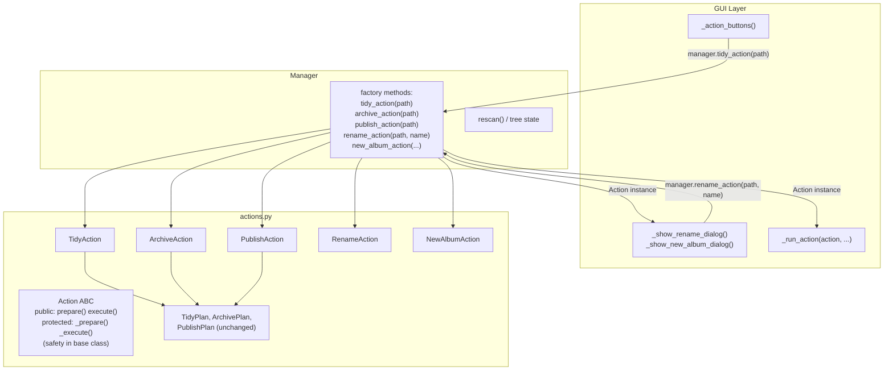
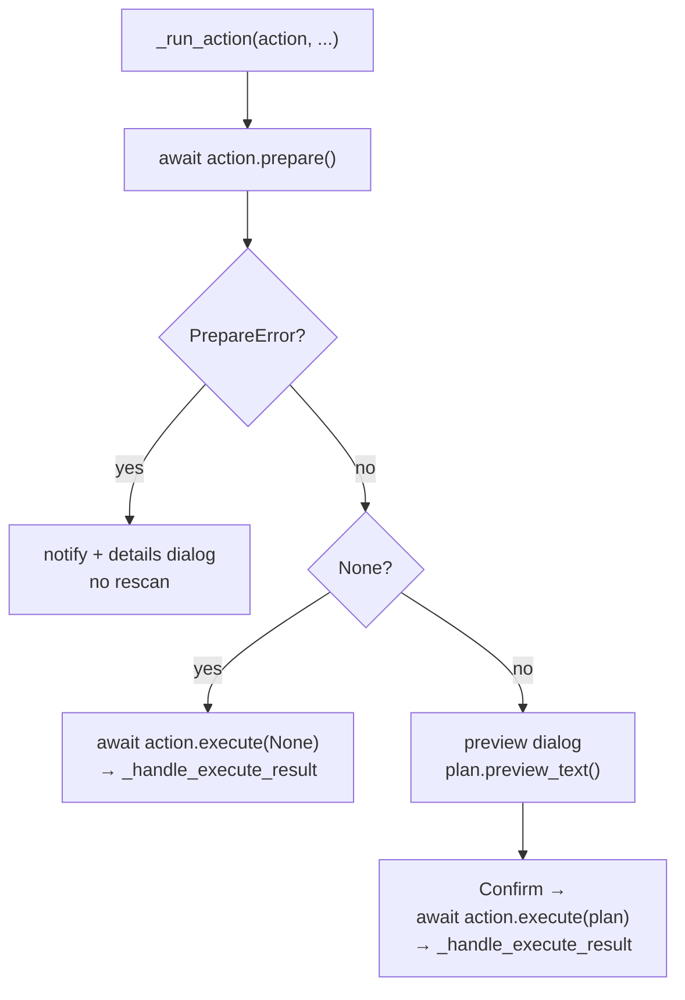

# Actions to Classes Refactor

## Architecture after refactor



## `_run_action` unified flow



## Changes per file

### [`src/photo_darkroom_manager/actions.py`](src/photo_darkroom_manager/actions.py)

**Keep unchanged:** `PrepareError`, `ActionResult`, `BaseResult`, `ActionPlan`, `TidyPlan`, `ArchivePlan`, `PublishPlan`, `_format_preview_path_names`, `_PREVIEW_PATH_LINES`.

**Add** `Action` abstract base class using the Template Method pattern. Public methods own the exception handling; subclasses implement the protected `_prepare`/`_execute` methods:

```python
import traceback
from abc import ABC, abstractmethod

class Action(ABC):
    # Public interface — always safe, never raises
    def prepare(self) -> ActionPlan | PrepareError | None:
        try:
            return self._prepare()
        except Exception:
            return PrepareError(False, "Internal error", traceback.format_exc())

    def execute(self, plan: ActionPlan | None) -> ActionResult:
        try:
            return self._execute(plan)
        except Exception:
            return ActionResult(False, "Internal error", details=traceback.format_exc())

    # Protected — subclasses implement these, may raise freely
    @abstractmethod
    def _prepare(self) -> ActionPlan | PrepareError | None: ...

    @abstractmethod
    def _execute(self, plan: ActionPlan | None) -> ActionResult: ...
```

**Add** five concrete action classes. Their bodies are the existing function bodies moved into `_prepare`/`_execute`:
- `TidyAction(folder_path)` — prepare body from `prepare_tidy`, execute body from `execute_tidy`
- `ArchiveAction(folder_path, darkroom_path, archive_path)` — from `prepare_archive` / `execute_archive`
- `PublishAction(album_path, showroom_path, darkroom_path)` — from `prepare_publish` / `execute_publish`
- `RenameAction(album_path, new_name, darkroom_path)` — `prepare()` returns `None`; execute body from `action_rename_album`
- `NewAlbumAction(darkroom_path, year, month, day, name)` — `prepare()` returns `None`; execute body from `action_new_album`

**Remove** all eight standalone free functions (`prepare_tidy`, `execute_tidy`, `prepare_archive`, `execute_archive`, `prepare_publish`, `execute_publish`, `action_rename_album`, `action_new_album`).

### [`src/photo_darkroom_manager/manager.py`](src/photo_darkroom_manager/manager.py)

**Remove** `_safe`, `_safe_prepare` module functions — exception safety now lives in `Action.prepare()`/`Action.execute()`.

**Replace** the six `prepare_*/execute_*` method pairs and `rename_album`/`new_album` (8 methods total) with **five typed factory methods** that return plain `Action` instances:

```python
def tidy_action(self, folder_path: Path) -> Action:
    return TidyAction(folder_path)

def archive_action(self, folder_path: Path) -> Action:
    return ArchiveAction(folder_path, self.settings.darkroom, self.settings.archive)

def publish_action(self, album_path: Path) -> Action:
    return PublishAction(album_path, self.settings.showroom, self.settings.darkroom)

def rename_action(self, album_path: Path, new_name: str) -> Action:
    return RenameAction(album_path, new_name, self.settings.darkroom)

def new_album_action(self, year: str, month: str, day: str | None, name: str) -> Action:
    return NewAlbumAction(self.settings.darkroom, year, month, day, name)
```

**Update imports** — remove old `actions.py` function imports; import `Action` and the five action classes instead.

### [`src/photo_darkroom_manager/gui/layout.py`](src/photo_darkroom_manager/gui/layout.py)

**Replace** `_run_preview_then_execute(prepare_fn, execute_fn, path, manager, rebuild_fn, label)` with `_run_action(action, manager, rebuild_fn, label)` implementing the three-branch flow shown above (PrepareError / None / ActionPlan).

**Update `_action_buttons`** — three calls drop from 6 arguments to 4:
```python
on_click=lambda _n=node: _run_action(
    manager.tidy_action(_n.path), manager, rebuild_fn, f"Tidying {_n.name}"
)
```

**Update `_show_rename_dialog`** — after dialog input, create action then call `_run_action`:
```python
async def do_rename():
    new_name = name_input.value.strip()
    if not new_name or new_name == node.name:
        dialog.close(); return
    dialog.close()
    await _run_action(
        manager.rename_action(node.path, new_name), manager, rebuild_fn, f"Renaming {node.name}"
    )
```

**Update `_show_new_album_dialog`** — same pattern, `manager.new_album_action(...)` then `_run_action`.

**Remove** the now-unused `Path` import from `layout.py` (it was only needed for `_run_preview_then_execute`'s `path: Path` parameter).
