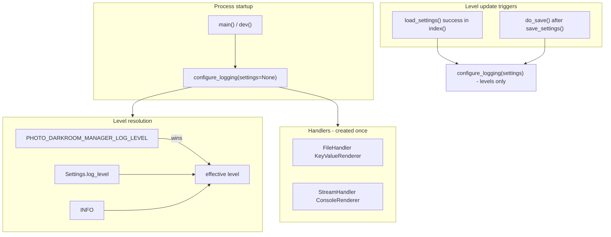

# Add structlog logging

## Decisions (from grill session)

| Area | Choice |
|------|--------|
| Purpose | Developer/operator diagnostics; UI unchanged |
| Library | **structlog** via stdlib bridge (`LoggerFactory` + `ProcessorFormatter`) |
| Sinks | File (`KeyValueRenderer`) + stderr (`ConsoleRenderer`, colors) |
| Log file | `{config_dir}/logs/{YYYY-MM-DD}_{HHMMSS}_{pid}.log`; delete files older than **30 days** on first setup per process |
| Level | `Settings.log_level` (default `INFO`) + **settings UI dropdown**; env `PHOTO_DARKROOM_MANAGER_LOG_LEVEL` always wins |
| Reconfigure | Idempotent: first call creates handlers/file; later calls (successful load, Save) only update levels |
| Scope | Boundary seams only — no per-folder scan or per-file move logs |
| Third-party | Cap `nicegui`, `uvicorn`, `uvicorn.error`, `uvicorn.access` at `WARNING` |
| Tests | Unit tests for `resolve_log_level`, path building, retention, idempotent reconfigure |

## Architecture



## 1. Dependency

Add `structlog` to [`pyproject.toml`](pyproject.toml) dependencies (pin with `~=` to match existing style).

## 2. New module: [`src/photo_darkroom_manager/logging_config.py`](src/photo_darkroom_manager/logging_config.py)

Central module owning all setup. Public API:

- `LOG_LEVEL_ENV = "PHOTO_DARKROOM_MANAGER_LOG_LEVEL"`
- `RETENTION_DAYS = 30`
- `resolve_log_level(settings: Settings | None) -> str` — env → `settings.log_level` → `"INFO"`
- `build_log_file_path(config_dir: Path) -> Path` — `logs/{date}_{HHMMSS}_{pid}.log`
- `configure_logging(settings: Settings | None = None, *, dev_mode: bool = False) -> Path | None` — returns log file path (or `None` if file handler already exists on reconfigure)

**First call:**
1. Resolve level via `resolve_log_level`
2. Ensure `get_config_dir() / "logs"` exists; run retention cleanup (mtime &lt; 30 days)
3. `structlog.configure(...)` with shared pre-chain processors ending in `ProcessorFormatter.wrap_for_formatter`
4. Attach root `logging` handlers:
   - `FileHandler` + `ProcessorFormatter(processor=KeyValueRenderer())`
   - `StreamHandler(stderr)` + `ProcessorFormatter(processor=ConsoleRenderer(colors=True))`
5. Set `photo_darkroom_manager` logger to resolved level; cap third-party loggers at `WARNING`
6. Log startup line: `app_started`, `log_file`, `level`, `dev_mode`, `pid`

**Subsequent calls:** update root/app/third-party levels only; do **not** add handlers or open a new file.

Use a module-level `_configured: bool` guard.

## 3. Settings: [`src/photo_darkroom_manager/settings.py`](src/photo_darkroom_manager/settings.py)

- Add `log_level: Literal["DEBUG", "INFO", "WARNING", "ERROR"] = "INFO"`
- Add `@field_validator("log_level")` normalizing case and rejecting unknown values
- In `load_settings()` / `save_settings()`: log via structlog (`settings_loaded`, `settings_saved`, `config_path`; `WARNING` on load validation failure if we add a safe wrapper — keep load function behavior unchanged, log in callers where exceptions are already handled)

Extend [`tests/test_settings.py`](tests/test_settings.py): round-trip `log_level` in save/load; default `INFO` when omitted.

## 4. GUI entry: [`src/photo_darkroom_manager/gui/gui_app.py`](src/photo_darkroom_manager/gui/gui_app.py)

**Startup** — at the top of `main()` and `dev()`, before `_register_pages()`:

```python
configure_logging(dev_mode=True)  # dev only
```

**Index route** — after successful `_try_load_settings()` (valid `Settings`):

```python
configure_logging(settings)
```

**Settings page** — add `ui.select` for log level (`DEBUG` / `INFO` / `WARNING` / `ERROR`), prefilled from `initial.log_level`.

**`do_save()`** — include `log_level=log_level_select.value` in `Settings(...)`, then after `save_settings(settings)`:

```python
configure_logging(settings, dev_mode=...)
```

## 5. Manager: [`src/photo_darkroom_manager/manager.py`](src/photo_darkroom_manager/manager.py)

Instrument `rescan()` only:

- `log.info("rescan_started", root=str(self.settings.darkroom))`
- Wrap scan with `time.perf_counter()`
- After `scan_darkroom`, walk tree to count `album` nodes and nodes with non-empty `issues` (small local helper, no changes to [`scan.py`](src/photo_darkroom_manager/scan.py))
- `log.info("rescan_complete", root=..., albums=..., issues=..., duration_ms=...)`

## 6. Actions: [`src/photo_darkroom_manager/actions.py`](src/photo_darkroom_manager/actions.py)

**Base `Action` class** ([`prepare`/`execute` wrappers](src/photo_darkroom_manager/actions.py)):

- Add `def log_context(self) -> dict[str, object]: return {}`
- After `_prepare()` / `_execute()`: log `action_prepare` / `action_execute` with `action=type(self).__name__`, `success`, `message`, and `**self.log_context()`
- On caught exception: `log.exception(...)` before returning `PrepareError` / `ExecutionResult` (traceback in log; UI `details` unchanged)

**Override `log_context()`** in each action subclass:

| Class | Context |
|-------|---------|
| `TidyAction` | `folder` |
| `ArchiveAction` | `folder` |
| `PublishAction` | `album` |
| `NewAlbumAction` | `darkroom`, `year`, `month` |
| `RenameAction` | `album` |
| `OpenExternalAppAction` | `folder` |

## 7. Tests: new [`tests/test_logging_config.py`](tests/test_logging_config.py)

| Test | Asserts |
|------|---------|
| `resolve_log_level` | env overrides settings; settings used when no env; default `INFO` |
| `build_log_file_path` | matches `{date}_{time}_{pid}` pattern under `logs/` |
| `cleanup_old_logs` | files older than 30 days removed; recent kept |
| `configure_logging` idempotent | second call returns same path, no duplicate handlers on root logger |

Use `tmp_path` + `monkeypatch` for `CONFIG_PATH_ENV` / log dir; reset logging state in fixture teardown if needed.

## 8. Finish

- Run `uv run ruff format`, `uv run ruff check --fix`, `uv run ty check`, `uv run pytest`
- Check off `add logging` in [`TODO.md`](TODO.md)

## Out of scope (explicit)

- Logging in `layout.py`, `scan.py`, `file_utils.py`, `media.py`
- Per-file move lines at INFO
- Log viewer in GUI
- Structured JSON output
