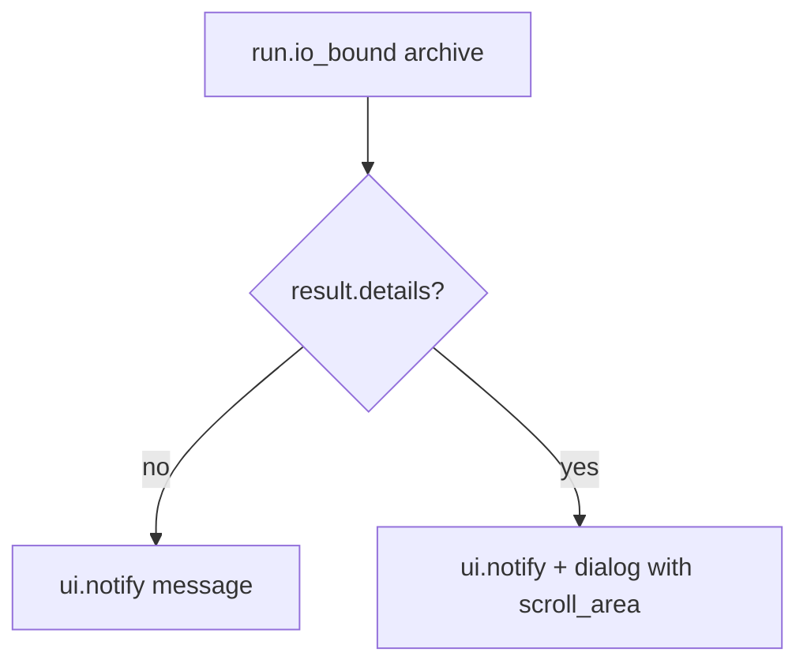

# Additive archival (merge) — Option B, GUI-focused

## Scope (this iteration)

- **Implement:** Python merge in `[file_utils.py](d:\workspace\photo-darkroom-manager\src\photo_darkroom_manager\file_utils.py)`, consume from `[action_archive](d:\workspace\photo-darkroom-manager\src\photo_darkroom_manager\gui\actions.py)` only.
- **Out of scope:** `[cli.py](d:\workspace\photo-darkroom-manager\src\photo_darkroom_manager\cli.py)` `archive` command (unchanged for now); **no new automated tests** (manual verification via GUI).

## What breaks today

`[action_archive](d:\workspace\photo-darkroom-manager\src\photo_darkroom_manager\gui\actions.py)` builds `target_dir = archive_path / album.relative_subpath` and bails if `target_dir.exists()`, then `[move_dir_safely](d:\workspace\photo-darkroom-manager\src\photo_darkroom_manager\file_utils.py)` **renames the entire source directory** and requires `target_dir` not to exist.

Archiving a **child** first creates parent dirs under the archive; archiving the **parent** later fails because `target_dir` already exists.

## Target behavior

- **Merge** contents under `folder_path` into `archive_path / album.relative_subpath`, preserving relative paths inside the selection.
- **Pre-scan duplicates:** if any destination file already exists, **fail before moving**; report each collision (source → dest).
- **Move** files, **prune** empty directories under the source up to `folder_path`.
- **Duplicate policy:** fail whole operation on any file collision (no silent overwrite).

Symlinks: align with existing move helpers where practical (same as `cstm_shutil_move` intent).

## Algorithm (unchanged from prior plan)

1. Resolve `dest_root` and `src_root`; walk `src_root`.
2. Pre-scan: for each file, if `dest_root / rel` exists → collect duplicate entries.
3. If duplicates → return failure with structured detail for GUI.
4. Else move each file (cross-volume behavior consistent with existing utilities), collect `MoveIssue` for partial failures.
5. Bottom-up `rmdir` empty dirs under source.

---

## Rich output in the GUI

### Current behavior

`[layout.py](d:\workspace\photo-darkroom-manager\src\photo_darkroom_manager\gui\layout.py)` `_run_action` runs the action on a worker thread via `run.io_bound`, then shows a **single-line** `[ui.notify](https://nicegui.io/documentation/notification)` for success or failure (`timeout=5000` on errors). `[ActionResult](d:\workspace\photo-darkroom-manager\src\photo_darkroom_manager\gui\actions.py)` is only `success: bool` + `message: str` — fine for short strings, **too small** for many duplicate paths or move-issue dumps.

### Recommended approach

1. **Extend the result type** (archive-only or general-purpose):
  - Keep `**message`** as a **short summary** (one line): e.g. `Archived 142 files to …` or `Archive blocked: 3 path conflicts`.
  - Add an optional `**details: str | None`** (plain multi-line text): e.g. one conflict per line `src → dest`, or `MoveIssue` lines. If `None`, behavior stays like today.
2. **Presentation helper** in `layout.py` (e.g. `_present_action_result(result)` or `_run_archive_action`):
  - **Always** show the short `message` in `ui.notify` (positive/negative) so the user gets immediate feedback.
  - **If `details` is non-empty** (especially on failure, or optionally on success when file count is huge): open a `**ui.dialog()`** containing a `**ui.scroll_area`** and a monospace or pre-wrapped label (paths need readable wrapping). Single **OK** button closes the dialog.
  - Optional: on **success** with no duplicates, only notify (no dialog) unless `details` is set for “moved N files” with a user preference later.
3. **Why not only notify:** NiceGUI toasts are poor for tens of paths; a scrollable dialog matches the “lot more rich output” requirement without changing every action — only archive (or any future action that sets `details`) uses the dialog path.
4. **Threading:** keep `run.io_bound` for the filesystem work; **open the dialog on the UI thread** after the await returns (same as today’s notify).

### Files to touch for presentation

- `[actions.py](d:\workspace\photo-darkroom-manager\src\photo_darkroom_manager\gui\actions.py)`: extend `ActionResult` with optional `details`, or introduce a small `@dataclass` that `action_archive` returns and normalize in `model.archive` — **simplest:** extend `ActionResult` with `details: str | None = None` so `_safe` and other actions stay unchanged (default `None`).
- `[layout.py](d:\workspace\photo-darkroom-manager\src\photo_darkroom_manager\gui\layout.py)`: archive button uses a dedicated async handler (or generalized `_present_action_result`) instead of plain `_run_action` when `details` must be shown.

---

## Code touchpoints

- `**[file_utils.py](d:\workspace\photo-darkroom-manager\src\photo_darkroom_manager\file_utils.py)`:** new merge helper returning move count, duplicate list, and/or `MoveIssue` list.
- `**[actions.py](d:\workspace\photo-darkroom-manager\src\photo_darkroom_manager\gui\actions.py)`:** `action_archive` uses helper; builds `ActionResult` with `message` + optional `details`.
- `**[layout.py](d:\workspace\photo-darkroom-manager\src\photo_darkroom_manager\gui\layout.py)`:** archive action presentation (notify + conditional dialog).

**README:** skip unless explicitly requested.
