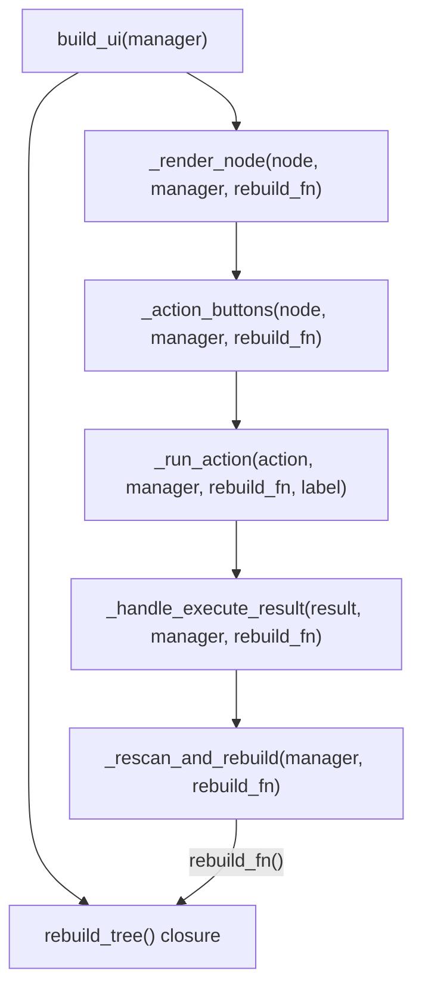
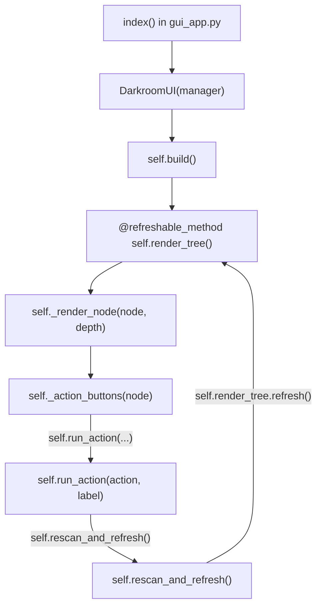

# DarkroomUI Class Refactor

Replace the current free-function layout with a `DarkroomUI` class. `manager` becomes `self.manager`, and the `rebuild_fn` closure is replaced by `self.render_tree.refresh()` (NiceGUI's `@ui.refreshable_method`).

## Current call-chain (the problem)

## Target structure

## Changes

### [`src/photo_darkroom_manager/gui/layout.py`](src/photo_darkroom_manager/gui/layout.py)

- Remove module-level mutable globals `_all_expansions` and `_expanded_paths`; move them to `self._all_expansions` and `self._expanded_paths` on `DarkroomUI`
- Keep pure free functions as-is: `_open_directory`, `_depth_class`, `_tree_btn`, `_present_action_details`
- Remove `build_ui(manager)` function entirely
- Create `DarkroomUI` class with:
  - `__init__(self, manager: DarkroomManager)` — stores `self.manager`, `self._all_expansions`, `self._expanded_paths`
  - `@ui.refreshable_method render_tree(self)` — replaces the `rebuild_tree` closure; clears `_all_expansions`, renders all year nodes
  - `async rescan_and_refresh(self)` — replaces `_rescan_and_rebuild`; calls `run.io_bound(self.manager.rescan)` then `self.render_tree.refresh()`
  - `async run_action(self, action, label)` — replaces `_run_action`; no `manager`/`rebuild_fn` params, calls `self.rescan_and_refresh()` internally
  - `async _handle_execute_result(self, result)` — replaces the free-function version
  - `_render_node(self, node, depth)` — replaces free function; calls `self._action_buttons(node)`
  - `_action_buttons(self, node)` — replaces free function; calls `self.run_action(...)`
  - `_show_rename_dialog(self, node)` — instance method
  - `_show_new_album_dialog(self)` — instance method
  - `build(self)` — builds header + column, calls `self.render_tree()`, then does initial `manager.rescan()` + `self.render_tree.refresh()`

### [`src/photo_darkroom_manager/gui/gui_app.py`](src/photo_darkroom_manager/gui/gui_app.py)

- Replace `from photo_darkroom_manager.gui.layout import build_ui` with `from photo_darkroom_manager.gui.layout import DarkroomUI`
- Change `build_ui(DarkroomManager(settings))` to `DarkroomUI(DarkroomManager(settings)).build()`
