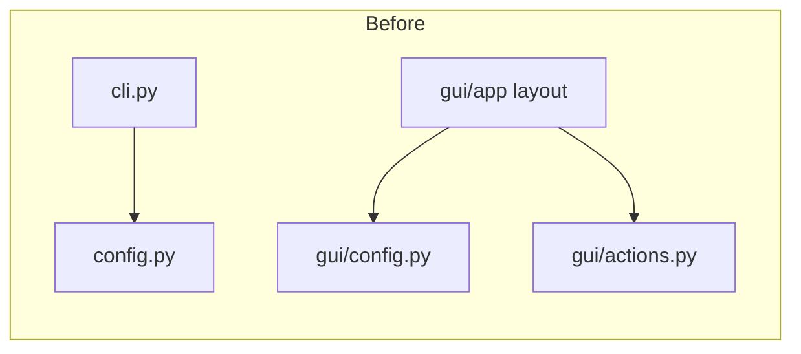
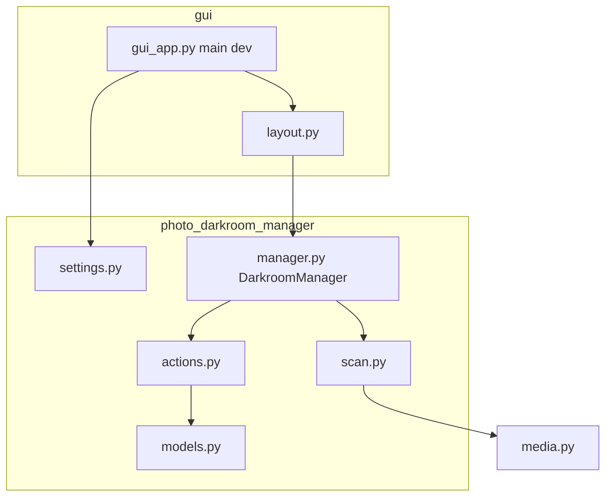

# Refactor: CLI removal, single settings source, fixed module layout

## Locked decisions (no forks)

| Topic | Decision |
|-------|----------|
| **Domain types** | [`models.py`](d:\workspace\photo-darkroom-manager\src\photo_darkroom_manager\models.py) holds `DarkroomYearAlbum` and `recognize_darkroom_album`. **Delete** [`darkroom.py`](d:\workspace\photo-darkroom-manager\src\photo_darkroom_manager\darkroom.py) after moving symbols. |
| **Core orchestration** | [`manager.py`](d:\workspace\photo-darkroom-manager\src\photo_darkroom_manager\manager.py) at package root; class **`DarkroomManager`** (replaces **`App`** from `gui/model.py` — stateful coordinator over `settings`, `scan`, `actions`). |
| **NiceGUI process entry** | **[`gui/gui_app.py`](d:\workspace\photo-darkroom-manager\src\photo_darkroom_manager\gui\gui_app.py)** with `main()` and `dev()` — renamed from `gui/app.py`. Import **`DarkroomManager`** from `photo_darkroom_manager.manager`. Inside **`gui_app.py`**, use **`app`** for NiceGUI’s usual naming without colliding with the **`manager`** module. |
| **Scanner module** | [`scan.py`](d:\workspace\photo-darkroom-manager\src\photo_darkroom_manager\scan.py) (from `gui/scanner.py`). |
| **Console scripts** | **`photo-darkroom-manager`** and **`dr-mng`** both call `photo_darkroom_manager.gui.gui_app:main`. **Remove** the **`dr-mng-gui`** entry entirely. |
| **Settings stack** | **`pydantic` only** in merged `settings.py`. **Drop `pydantic-settings`** for now (remove from deps via `uv remove`, refresh lock). |

## Current state (problems)

| Issue | Detail |
|-------|--------|
| **Duplicate workflows** | [`cli.py`](d:\workspace\photo-darkroom-manager\src\photo_darkroom_manager\cli.py) reimplements workflows already in [`gui/actions.py`](d:\workspace\photo-darkroom-manager\src\photo_darkroom_manager\gui\actions.py). |
| **Two configs** | Root [`config.py`](d:\workspace\photo-darkroom-manager\src\photo_darkroom_manager\config.py) vs [`gui/config.py`](d:\workspace\photo-darkroom-manager\src\photo_darkroom_manager\gui\config.py); only CLI used the former. |
| **Naming** | `gui/model.py` defines `App` while `gui/app.py` ran the window — resolved by root **`manager.py`** (`DarkroomManager`) + **`gui/gui_app.py`**. |

## Target architecture

## Dependency rule (core vs GUI)

- **`manager.py`, `actions.py`, `scan.py`, `models.py`, `settings.py`** must not import `gui` or `nicegui`.
- **`gui/gui_app.py`** and **`gui/layout.py`** import from `photo_darkroom_manager.manager`, `settings`, etc. Direction is always **gui → core**.

## Concrete file changes

1. **Delete** [`cli.py`](d:\workspace\photo-darkroom-manager\src\photo_darkroom_manager\cli.py).

2. **Dependencies** ([`pyproject.toml`](d:\workspace\photo-darkroom-manager\pyproject.toml)): use **`uv remove`** (and **`uv add`** only if needed) for dependency changes — **do not** hand-edit dependency tables. Remove `typer`, `rich`, and **`pydantic-settings`**. Remove `dr-mng-gui` script. Set `photo-darkroom-manager` and `dr-mng` to `photo_darkroom_manager.gui.gui_app:main`. When adding packages, **pin with `~=`**. After edits, run **`uv lock`** then **`uv sync`** so [`uv.lock`](d:\workspace\photo-darkroom-manager\uv.lock) matches the tree (including no CLI-only deps).

3. **`models.py`**: Move contents of [`darkroom.py`](d:\workspace\photo-darkroom-manager\src\photo_darkroom_manager\darkroom.py) here; delete `darkroom.py`; update imports (`from photo_darkroom_manager.models import ...`).

4. **Lift** `gui/actions.py` → `actions.py`; `gui/scanner.py` → `scan.py`; `gui/model.py` → root **`manager.py`** (class **`DarkroomManager`**, imports from `settings`, `actions`, `scan`, `models`).

5. **`settings.py`**: Merge behavior from `gui/config.py` using **pydantic only** (`BaseModel`, validators, etc.) — **no `pydantic-settings`** for now. Delete `gui/config.py` and root `config.py` (including `find_darkroom_yaml`). Document breaking change: `darkroom.yaml` discovery removed — README points to GUI config path.

6. **Rename** `gui/app.py` → **`gui/gui_app.py`**: same `main` / `dev` / page registration; `from photo_darkroom_manager.manager import DarkroomManager`; `build_ui(DarkroomManager(settings))`. Use **`app`** as the conventional NiceGUI name inside this module where the framework expects it.

7. **Update** [`gui/layout.py`](d:\workspace\photo-darkroom-manager\src\photo_darkroom_manager\gui\layout.py): type hints and parameters use **`DarkroomManager`** (not `App`); `from photo_darkroom_manager.manager import DarkroomManager`.

8. **Docs**: Update **every** doc that mentions the old module path or dev entrypoint, including [`README.md`](d:\workspace\photo-darkroom-manager\README.md), [`DEV.md`](d:\workspace\photo-darkroom-manager\DEV.md), and [`.cursor/rules/development-guide.mdc`](d:\workspace\photo-darkroom-manager\.cursor\rules\development-guide.mdc). GUI-first usage; dev command **`uv run python -m photo_darkroom_manager.gui.gui_app`** (replace any `-m photo_darkroom_manager.gui.app`).

## Dead code cleanup

Grep for: `darkroom` (module path), `gui.actions`, `gui.scanner`, `gui.model`, `gui.config`, `GuiSettings`, `config.Settings`, `dr-mng-gui`, `photo_darkroom_manager.gui.app`, `-m photo_darkroom_manager.gui.app`, **`photo_darkroom_manager.app`** (removed module), `pydantic_settings`, and stale **`App`** references that meant the old model class (should be **`DarkroomManager`**).

## Verification

- `uv run ruff format .` and `uv run ruff check .`
- Smoke: `uv run python -m photo_darkroom_manager.gui.gui_app` (dev server port 8090); confirm `uv.lock` is consistent after dependency work (`uv sync` clean)

## Scope note

No behavioral change to prepare/execute logic beyond import paths and file layout.
