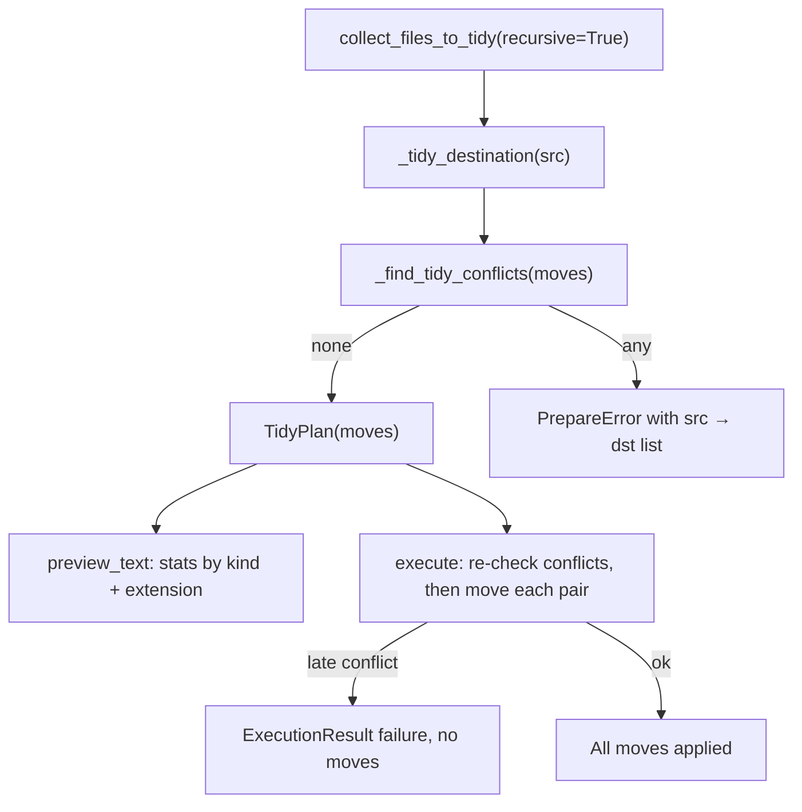

# Fix tidy per-file target calculation

## Problem

[`TidyAction`](src/photo_darkroom_manager/actions.py) collects misplaced files **recursively** but **execute** flattens all moves to `{action_root}/PHOTOS/` and `{action_root}/VIDEOS/`:

```234:247:src/photo_darkroom_manager/actions.py
        if plan.photo_paths:
            photos_dir = folder_path / PHOTOS_FOLDER
            ...
            for p in plan.photo_paths:
                shutil.move(str(p), str(photos_dir / p.name))
```

Tidying from an album root therefore sends `iPhone/IMG.jpg` to `album/PHOTOS/` instead of `iPhone/PHOTOS/`.

## Target behavior (decisions locked in)



**Destination rule** (`_tidy_destination(src)` in [`actions.py`](src/photo_darkroom_manager/actions.py)):

| Source | Destination |
|--------|-------------|
| Loose file in any folder | `{parent}/PHOTOS/{name}` or `{parent}/VIDEOS/{name}` |
| Video inside `PHOTOS/` | `{grandparent}/VIDEOS/{name}` (sibling bucket) |
| Photo inside `VIDEOS/` | `{grandparent}/PHOTOS/{name}` (sibling bucket) |

Photo vs video classification: use the file's own extension via existing `is_file_a_photo` / `is_file_a_video` (same predicates as collection).

**Conflicts**: block when any `dst` already exists on disk and is not the same path as `src`; also block when two moves in the plan share the same `dst`. List every conflicting `src → dst` in `PrepareError.details` (archive-style). Execute re-checks before **any** move; abort all on late conflict.

**Preview**: stats only — photo/video totals plus extension breakdown (e.g. `.jpg: 10`, `.xmp: 5`). No per-file listing on success.

**Scope**: helpers stay in [`actions.py`](src/photo_darkroom_manager/actions.py) only (no `media.py` extraction).

## Implementation

### 1. Add tidy move helpers in `actions.py`

- **`_tidy_destination(src: Path) -> Path`** — implements the table above using `PHOTOS_FOLDER` / `VIDEOS_FOLDER` from [`settings.py`](src/photo_darkroom_manager/settings.py).
- **`_build_tidy_moves(folder_path: Path) -> list[tuple[Path, Path]]`** — call existing `collect_files_to_tidy(folder_path, recursive=True)`, map each source to `(src, _tidy_destination(src))`.
- **`_find_tidy_conflicts(moves: Sequence[tuple[Path, Path]]) -> list[tuple[Path, Path]]`** — return conflicting pairs where:
  - `dst.exists()` and `dst.resolve() != src.resolve()`, or
  - duplicate `dst` within the move list (second occurrence is a conflict).
- **`_format_tidy_move_lines(root: Path, pairs: Sequence[tuple[Path, Path]]) -> str`** — format `src_rel → dst_rel` for error details (mirror archive's `PrepareError` formatting).

### 2. Refactor `TidyPlan`

Replace `photo_paths` / `video_paths` with:

```python
@dataclass(frozen=True)
class TidyPlan(ActionPlan):
    folder_path: Path
    moves: tuple[tuple[Path, Path], ...]
```

**`preview_text()`**:
- `Root folder: {folder_path}`
- `Photos to move: N` / `Videos to move: N` (classify each `src` by extension)
- Under `Photos:` / `Videos:`, list `.ext: count` lines sorted by extension
- Remove use of `_format_preview_path_names` (delete helper if unused)

### 3. Update `TidyAction._prepare`

1. Validate directory (unchanged).
2. `moves = _build_tidy_moves(folder_path)`; empty → `PrepareError("Nothing to tidy", ...)`.
3. `conflicts = _find_tidy_conflicts(moves)`; non-empty → `PrepareError("Tidy blocked: N file conflict(s)", details=...)`.
4. Return `TidyPlan(folder_path=folder_path, moves=tuple(moves))`.

### 4. Update `TidyAction._execute`

1. Re-run `_find_tidy_conflicts(plan.moves)` on disk.
2. If conflicts → `ExecutionResult(False, "Tidy blocked: ...", details=...)` with **zero** moves performed.
3. Otherwise loop `for src, dst in plan.moves`: `dst.parent.mkdir(parents=True, exist_ok=True)` then `shutil.move`.
4. Return `ExecutionResult(True, f"Tidied {len(plan.moves)} files")`.

### 5. Tests in [`tests/actions/test_tidy.py`](tests/actions/test_tidy.py)

Keep existing collection tests unchanged.

**Add / update**:

| Test | Asserts |
|------|---------|
| `test_tidy_recursive_from_album_moves_to_subfolder_photos` | `album/iPhone/img.jpg` → `album/iPhone/PHOTOS/img.jpg` after execute |
| `test_tidy_sibling_bucket_video_in_photos` | `iPhone/PHOTOS/clip.mp4` → `iPhone/VIDEOS/clip.mp4` |
| `test_tidy_sibling_bucket_photo_in_videos` | `iPhone/VIDEOS/shot.jpg` → `iPhone/PHOTOS/shot.jpg` |
| `test_tidy_prepare_blocks_when_destination_exists` | pre-create target file → `PrepareError`, details contain `→` |
| `test_tidy_execute_aborts_on_late_conflict` | valid plan, create conflict between prepare and execute → failure, source untouched |
| `test_tidy_preview_text_extension_stats` | `preview_text()` has `.jpg:` counts, no individual filenames |
| Update `test_tidy_executes_on_copied_data_fixture` | use `plan.moves` instead of `plan.photo_paths` |

### 6. Lint / typecheck

Per workspace rules after changes: `uv run ruff format`, `uv run ruff check --fix`, `uv run ty check`.

### 7. TODO cleanup

Mark the bug line in [`TODO.md`](TODO.md) as done (or remove it) when implementing.

## Out of scope

- `media.py` extraction ([`IMPROVE_ARCHITECTURE.md`](IMPROVE_ARCHITECTURE.md) #1)
- Localized subtree rescan after tidy
- Partial/eager retry on failed moves ([`TODO.md`](TODO.md) line 15)
