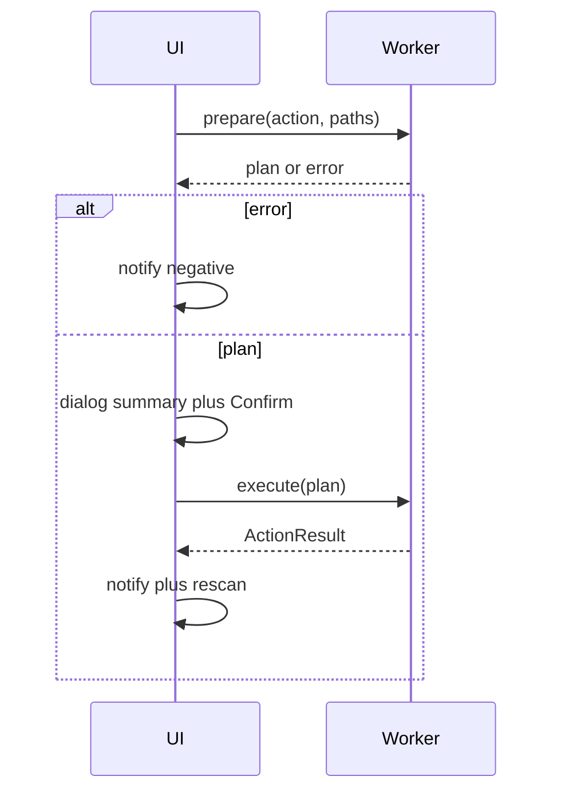

# GUI: preview and confirm before destructive actions

## Context

- In [`cli.py`](d:\workspace\photo-darkroom-manager\src\photo_darkroom_manager\cli.py), **archive** (lines 350–362), **publish** (lines 481–547), and **tidy** (lines 641–651) all show context (paths, counts, conflicts) and call `typer.confirm(...)` before moving files.
- The GUI in [`layout.py`](d:\workspace\photo-darkroom-manager\src\photo_darkroom_manager\gui\layout.py) uses [`_run_action`](d:\workspace\photo-darkroom-manager\src\photo_darkroom_manager\gui\layout.py) (lines 132–145), which immediately invokes `model.tidy` / `model.archive` / `model.publish` via `run.io_bound` with no review step.
- **In scope:** Tidy, Archive, Publish (large / destructive moves). **Out of scope:** New Album (creates empty structure), and **Rename** unless you want a lightweight confirm later (single folder rename, smaller blast radius).

## Design

Use a **prepare → confirm in UI → execute** pattern:

1. **Prepare** (CPU/IO on worker thread): validate paths, resolve album/showroom/archive targets, compute what *would* happen. Return either an error result (same spirit as `ActionResult`) or an immutable **plan** object holding everything execute needs (so logic is not duplicated and listing stays consistent).
2. **Review**: NiceGUI dialog with title, summary (paths, counts, conflicts), scrollable details for move lists when useful, **Cancel** and **Confirm** (primary).
3. **Execute** (worker thread): run the actual moves using the plan; reuse the same code paths as today’s [`actions.py`](d:\workspace\photo-darkroom-manager\src\photo_darkroom_manager\gui\actions.py) implementations.

## Per-action behavior

| Action | Prepare should show | Execute |
|--------|---------------------|---------|
| **Tidy** | Photo/video counts (and optionally truncated path lists). If nothing to move, treat as success with a clear message and skip execute or no-op. | Same moves as current `action_tidy` — **preserve existing branching** (photo-only vs video-only vs both); do not silently change behavior vs current GUI. |
| **Archive** | Album recognition, `source` folder, **archive target** `dest_root`, file count, and **duplicate/conflict pairs** if any (mirror today’s failure semantics: block when duplicates exist). | Call existing [`merge_tree_into_archive`](d:\workspace\photo-darkroom-manager\src\photo_darkroom_manager\file_utils.py) with the same arguments as [`action_archive`](d:\workspace\photo-darkroom-manager\src\photo_darkroom_manager\gui\actions.py) today. |
| **Publish** | File count, showroom **target_dir**, and **conflicts** (source file already exists at destination), matching CLI’s [`publish`](d:\workspace\photo-darkroom-manager\src\photo_darkroom_manager\cli.py) flow (create target if missing — show that in preview). On confirm with conflicts, user accepts overwrite (CLI asks once). | Same `shutil.move` loop as current `action_publish`. |

**Archive preview implementation note:** The merge logic already separates “collect leaves + detect blocking destinations” from “move” ([`merge_tree_into_archive`](d:\workspace\photo-darkroom-manager\src\photo_darkroom_manager\file_utils.py) lines 118–127). Prefer a small **extracted helper** in `file_utils.py` (e.g. `preview_merge_into_archive(source_dir, dest_root) -> leaf paths, duplicates`) used by both `merge_tree_into_archive` and GUI prepare, so preview and execute cannot drift. Alternatively, duplicate only the leaf/duplicate loop in `actions.py` — acceptable but slightly higher drift risk.

## Files to touch

- [`photo_darkroom_manager/gui/actions.py`](d:\workspace\photo-darkroom-manager\src\photo_darkroom_manager\gui\actions.py): Add dataclasses for `TidyPlan`, `ArchivePlan`, `PublishPlan` (or one tagged union), `prepare_*` and `execute_*` functions; refactor current `action_*` bodies into execute paths or thin wrappers for backward clarity.
- [`photo_darkroom_manager/gui/model.py`](d:\workspace\photo-darkroom-manager\src\photo_darkroom_manager\gui\model.py): Expose `prepare_tidy` / `execute_tidy` (and archive/publish) with existing `_safe` pattern; plans are plain data — no need to pickle.
- [`photo_darkroom_manager/gui/layout.py`](d:\workspace\photo-darkroom-manager\src\photo_darkroom_manager\gui\layout.py): Replace direct `_run_action` for the three buttons with a new helper (e.g. `_run_preview_then_execute`) that opens the confirmation dialog and only calls execute on confirm; keep `_run_action` for any future immediate actions or delete if unused.
- Optionally [`photo_darkroom_manager/file_utils.py`](d:\workspace\photo-darkroom-manager\src\photo_darkroom_manager\file_utils.py): Extract preview helper for archive merge (recommended).

## UX / edge cases

- **Empty tidy:** Show “0 photos, 0 videos to move” and either disable Confirm or confirm with a neutral message — avoid a no-op that looks like success without clarity.
- **Long lists:** Truncate with “… and N more” in the dialog to keep the UI responsive (same spirit as CLI tables, but bounded).
- **Race between preview and execute:** Rare; acceptable to document implicitly (same as CLI time gap between confirm and move).

## Verification

- Manually: trigger Tidy / Archive / Publish on a test tree — dialog appears first; Cancel leaves tree unchanged; Confirm performs the operation and triggers rescan as today.
- Run `uv run ruff format .` and `uv run ruff check .` after implementation per project rules.
