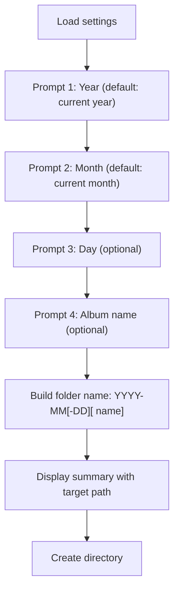

# New Album CLI Command

## Context

Albums live at `<DARKROOM>/<YEAR>/<ALBUM>/` where `<ALBUM>` follows the pattern `YYYY-MM[-DD][ <name>]` (e.g., `2026-01`, `2026-03-15`, `2026-03 Holiday`, `2026-03-15 Holiday`). The `MM` is a month (01-12), and `DD` is an optional day (01-31).

The command will be added to [src/photo_darkroom_manager/cli.py](src/photo_darkroom_manager/cli.py). Settings are loaded via `cli_load_settings()` from [src/photo_darkroom_manager/config.py](src/photo_darkroom_manager/config.py), which discovers `darkroom.yaml` by walking up from CWD. The CWD does not affect album placement -- only `settings.darkroom` matters.

## Command flow

## Implementation details

### 1. Add `new_album` command to `cli.py`

- Decorated with `@app.command(name="new-album")`
- Four prompts in sequence:
  - **Year**: `typer.Option(prompt=True)`, default `str(datetime.now().year)` -- user can also pass `--year 2025` to skip prompt
  - **Month**: `typer.Option(prompt=True)`, default `f"{datetime.now().month:02d}"` -- user can also pass `--month 03` to skip prompt; validate 01-12
  - **Day**: `typer.Option(prompt="Day (optional, press Enter to skip)")`, default `""` -- optional; if provided, validate 01-31
  - **Name**: `typer.Option(prompt="Album name (optional, press Enter to skip)")`, default `""` -- user can press Enter to skip

### 2. Build the album folder name

- Base: `"YYYY-MM"` (e.g., `"2026-03"`)
- With day: `"YYYY-MM-DD"` (e.g., `"2026-03-15"`)
- With name: `"YYYY-MM name"` (e.g., `"2026-03 Holiday"`)
- With day and name: `"YYYY-MM-DD name"` (e.g., `"2026-03-15 Holiday"`)

### 3. Create the directory

- Target path: `settings.darkroom / year / album_folder_name`
- If the target already exists, print an error and exit
- Create with `Path.mkdir(parents=True)` -- `parents=True` ensures the year folder is created if needed
- Print the created path using `cli_render_path()` and existing Rich patterns

### 4. UX output

Follow existing patterns:

- `cli_print_header("... New Album")` at the top
- Show info table with year, month, day (if provided), name (if provided), target path
- Print success message with the created path

No confirmation prompt -- creating an empty folder is a lightweight, non-destructive operation that doesn't warrant it.

## Files to modify

- [src/photo_darkroom_manager/cli.py](src/photo_darkroom_manager/cli.py) -- add the `new_album` command function
