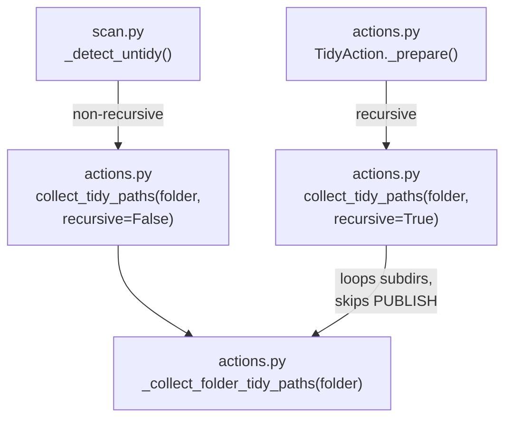

# Refactor Tidy Logic

Centralize tidy detection logic in `actions.py`, make it recursive, and have `scan.py` depend on it — eliminating the duplicate rule in `_detect_untidy`.

## Architecture After Change



## Changes

### [`actions.py`](src/photo_darkroom_manager/actions.py)

**1. Replace `_collect_tidy_photo_video_paths` with `_collect_folder_tidy_paths`**

Same stem-grouping + sidecar glob logic, but predicate flips to "correct state": photos belong in `PHOTOS/`, videos belong in `VIDEOS/`. `PHOTOS/` and `VIDEOS/` are scanned normally — the predicate handles them (videos inside `PHOTOS/` are misplaced, photos inside `VIDEOS/` are misplaced).

```python
def _collect_folder_tidy_paths(folder: Path) -> tuple[list[Path], list[Path]]:
    seen_stems: set[str] = set()
    photo_paths: list[Path] = []
    video_paths: list[Path] = []

    for item in folder.iterdir():
        if not item.is_file():
            continue
        stem = item.name.split(".")[0]
        if stem in seen_stems:
            continue
        seen_stems.add(stem)

        all_related = list(folder.glob(f"{stem}.*"))
        suffixes = [f.name.split(".", 1)[-1] for f in all_related]

        if is_file_a_photo(suffixes) and not is_file_a_video(suffixes):
            if folder.name != PHOTOS_FOLDER:
                photo_paths.extend(all_related)
        elif is_file_a_video(suffixes) and not is_file_a_photo(suffixes):
            if folder.name != VIDEOS_FOLDER:
                video_paths.extend(all_related)

    return photo_paths, video_paths
```

**2. Add public `collect_tidy_paths`**

Skips `PUBLISH/` entirely (both as root and when recursing). `recursive=False` for single-dir use by `_detect_untidy`; `recursive=True` for full subtree use by `TidyAction`.

```python
def collect_tidy_paths(
    folder_path: Path, *, recursive: bool = False
) -> tuple[list[Path], list[Path]]:
    if PUBLISH_FOLDER in folder_path.parts:
        return [], []

    photo_paths, video_paths = _collect_folder_tidy_paths(folder_path)

    if recursive:
        for child in sorted(folder_path.iterdir()):
            if child.is_dir() and child.name != PUBLISH_FOLDER:
                p, v = collect_tidy_paths(child, recursive=True)
                photo_paths.extend(p)
                video_paths.extend(v)

    return photo_paths, video_paths
```

**3. Update `TidyAction._prepare`**

```python
photo_paths, video_paths = collect_tidy_paths(folder_path, recursive=True)
```

### [`scan.py`](src/photo_darkroom_manager/scan.py)

**4. Replace `_detect_untidy`**

```python
from photo_darkroom_manager.actions import collect_tidy_paths

def _detect_untidy(directory: Path) -> bool:
    photos, videos = collect_tidy_paths(directory)  # recursive=False
    return bool(photos or videos)
```

Remove now-unused imports: `PHOTO_EXTENSIONS`, `VIDEO_EXTENSIONS`, `FOLDERS_EXEMPT_FROM_TIDY`.

## Correctness improvements over current code

- Tidy is now **recursive** — misplaced files in subfolders are found and moved.
- `PHOTOS/` and `VIDEOS/` are scanned with correct logic — a video sitting in `PHOTOS/` is now correctly detected as misplaced.
- `_detect_untidy` uses the exact same predicate as the action — no more perpetual untidy badge for file groups that can't actually be moved.
- `scan.py` has zero knowledge of tidy rules — all logic lives in `actions.py`.

## What stays the same
- `TidyPlan`, `TidyAction._execute`, all other actions — untouched.
- `FOLDERS_EXEMPT_FROM_TIDY` stays in `constants.py` (still used elsewhere if needed).
- `scan.py`'s tree-walk and `_propagate_issues` logic — untouched.
