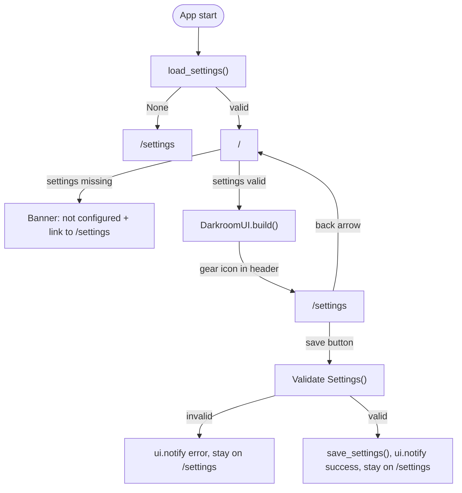

# Settings Page Routing Refactor

## New routing structure



## Changes

### [`gui_app.py`](src/photo_darkroom_manager/gui/gui_app.py)

- **`_build_setup_page()`** — remove the `ui.navigate.to("/")` call on save. Replace with `ui.notify("Saved")`. Add a back-arrow button (`ui.button(icon="arrow_back", on_click=lambda: ui.navigate.to("/"))`) at the top. Accept an optional `Settings` arg to pre-fill the inputs with current values.

- **`_register_pages()`** — register two routes:
  - `@ui.page("/")`: load settings; if `None`, redirect to `/settings`; otherwise build `DarkroomUI`. Wrap `DarkroomManager` construction in try/except so stale/invalid paths show a banner instead of crashing.
  - `@ui.page("/settings")`: always build the settings page, pre-filling with `load_settings()` if available.

### [`layout.py`](src/photo_darkroom_manager/gui/layout.py)

- **`DarkroomUI.build()`** — add a gear icon button at the end of the header row:
  ```python
  ui.button(icon="settings", on_click=lambda: ui.navigate.to("/settings")).props("dense").tooltip("Settings")
  ```
