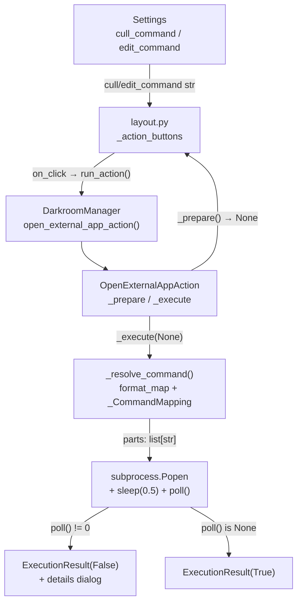

# External App Launch Feature

## Files changed

- [`src/photo_darkroom_manager/media.py`](src/photo_darkroom_manager/media.py) — add `ALL_IMAGE_EXTENSIONS`
- [`src/photo_darkroom_manager/settings.py`](src/photo_darkroom_manager/settings.py) — add two optional fields
- [`src/photo_darkroom_manager/actions.py`](src/photo_darkroom_manager/actions.py) — add action + helpers
- [`src/photo_darkroom_manager/manager.py`](src/photo_darkroom_manager/manager.py) — add factory method
- [`src/photo_darkroom_manager/gui/layout.py`](src/photo_darkroom_manager/gui/layout.py) — add Cull/Edit buttons
- [`src/photo_darkroom_manager/gui/gui_app.py`](src/photo_darkroom_manager/gui/gui_app.py) — add settings inputs

## Data flow



## 1. `media.py` — broader image extensions

Add alongside existing sets:
```python
ALL_IMAGE_EXTENSIONS = PHOTO_EXTENSIONS | {
    "arw", "cr2", "cr3", "nef", "orf", "dng", "raf", "rw2", "pef", "tif", "tiff",
}
```

## 2. `settings.py` — two optional fields

```python
class Settings(BaseModel):
    darkroom: Path
    showroom: Path
    archive: Path
    cull_command: str | None = None
    edit_command: str | None = None
```

Backwards-compatible — existing YAML files without these keys still load fine.

## 3. `actions.py` — `OpenExternalAppAction`

Three private helpers before the class:

- `_find_first_image(folder)` — `min()` over `folder.iterdir()` filtered by `ALL_IMAGE_EXTENSIONS`, keyed by `f.name`; returns `None` on empty or `PermissionError`
- `_NoImageFound` — sentinel exception
- `_CommandMapping` — custom mapping for `format_map`:
  - `"folder"` → `str(folder)`
  - `"first_image_in_folder"` → calls `_find_first_image`, raises `_NoImageFound` if missing
  - any other key → raises `KeyError` (unknown placeholder)
- `_resolve_command(template, folder)` — calls `template.format_map(_CommandMapping(folder))`, catches `_NoImageFound` → `PrepareError`, catches `KeyError` → `PrepareError`, then `shlex.split`

`OpenExternalAppAction.__init__(command_template, folder_path)`:
- `_prepare()` → calls `_resolve_command`, returns `PrepareError` on failure, else `None` (no confirmation dialog)
- `_execute(None)` → re-resolves, `Popen(parts, stdout=PIPE, stderr=PIPE)`, catches `FileNotFoundError` / `OSError`, then `time.sleep(0.5)` + `proc.poll()`:
  - `poll() is None` or `poll() == 0` → `ExecutionResult(True, ...)`
  - `poll() != 0` → read stdout/stderr, indent each line with two spaces, return `ExecutionResult(False, ..., details)`

## 4. `manager.py` — factory

```python
def open_external_app_action(self, command_template: str, folder_path: Path) -> Action:
    return OpenExternalAppAction(command_template, folder_path)
```

## 5. `layout.py` — Cull/Edit buttons

Inside the existing `if node.node_type in ("album", "subfolder"):` block, alongside Tidy and Archive. Buttons are only rendered when the corresponding setting is non-None:

```python
settings = self.manager.settings
if settings.cull_command:
    _tree_btn("Cull", "filter_frames", on_click=lambda _n=node: self.run_action(
        self.manager.open_external_app_action(settings.cull_command, _n.path),
        f"Culling {_n.name}",
    )).tooltip(f"Open in culling app\nCommand: {settings.cull_command}")
if settings.edit_command:
    _tree_btn("Edit", "tune", on_click=lambda _n=node: self.run_action(
        self.manager.open_external_app_action(settings.edit_command, _n.path),
        f"Editing {_n.name}",
    )).tooltip(f"Open in editing app\nCommand: {settings.edit_command}")
```

## 6. `gui_app.py` — settings page inputs

After the archive input, add a section with a shared tooltip explaining both placeholders:

```python
PLACEHOLDER_HELP = (
    "Placeholders:\n"
    "  {folder}                 absolute path to the album folder\n"
    "  {first_image_in_folder}  absolute path to the first image in the folder"
)
```

Two `ui.input` fields with `.tooltip(PLACEHOLDER_HELP)`, values initialised from `initial.cull_command` / `initial.edit_command`. In `do_save()`, pass `cull_command=... or None` and `edit_command=... or None` (empty string → `None`).
