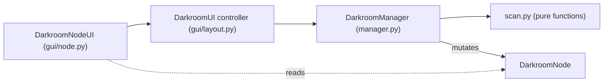
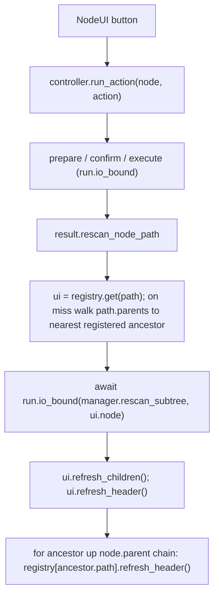

## Goal

Primary driver is performance: one action triggers one local subtree disk scan + a minimal re-render, never a full-tree walk and full UI rebuild. The architectural decoupling (dependency arrow points UI to model only; `bind()` dropped) falls out for free. Success criterion: a `tidy` on one album rescans only that album's subtree and never calls full `rescan()`.

## Target layering



## Post-action flow



## 1. Model: keep `scan.py` pure

In [src/photo_darkroom_manager/scan.py](src/photo_darkroom_manager/scan.py):

- Add a back-pointer to `DarkroomNode`, excluded from repr/eq to avoid the `parent`/`children` cycle blowing up:

```python
parent: DarkroomNode | None = field(default=None, repr=False, compare=False)
```

  Set it wherever `children.append(...)` happens (`_scan_year`, `_scan_album`, `_scan_subfolder`, `scan_darkroom`).
- Split issues into local vs propagated: add `local_issues: set[str]` (this folder's own issues) and keep `issues` as the propagated union (`local ∪ union(children.issues)`). `_propagate_issues` currently overwrites `issues` with the union, destroying the local distinction; rework it to read `local_issues`.
- Add `rescan_subtree(node)` that mutates the node in place: recompute `stats` + `local_issues`, rebuild `children` fresh (each new child gets `parent` set), then re-roll stats and re-aggregate issues. No deep child reconcile. This handles `tidy` creating new `PHOTOS/`/`VIDEOS/` subfolders.
- Add an upstream helper that walks `node.parent` to root, at each ancestor re-summing children stats and recomputing `issues = local_issues ∪ union(children.issues)` (re-aggregate, never delta, so a sibling still-untidy keeps the ancestor untidy).

## 2. Action contract: `actions.py`

In [src/photo_darkroom_manager/actions.py](src/photo_darkroom_manager/actions.py):

- Replace `ExecutionResult.requires_rescan: bool = True` (line 129) with `rescan_node_path: Path | None = None` (the subtree root to rescan; `None` = nothing).
- Update each success-path result to set `rescan_node_path`:
  - `TidyAction` (line ~370): `folder_path`
  - `PublishAction` (line ~587): `album_path`
  - `NewAlbumAction` (line ~651): `darkroom / year` (parent year dir)
  - `RenameAction` (line ~725): `album_path.parent` (the year; sibling order/path changes)
  - `ArchiveAction` (success ~482): `folder_path.parent` (node removed)
  - `OpenExternalAppAction` (success ~863, currently defaults True): `folder_path`
- All failure paths already set `requires_rescan=False`; they become the `None` default (drop the kwarg).

## 3. Manager: sole tree mutator

In [src/photo_darkroom_manager/manager.py](src/photo_darkroom_manager/manager.py):

- Add `rescan_subtree(self, node: DarkroomNode) -> DarkroomNode` that calls the `scan.py` in-place rescan + upstream re-aggregation, symmetric with the existing `rescan()`. Keeps the manager the only place that mutates `self.tree`.

## 4. GUI split into three modules

Decompose [src/photo_darkroom_manager/gui/layout.py](src/photo_darkroom_manager/gui/layout.py) (534 lines):

- New [src/photo_darkroom_manager/gui/widgets.py](src/photo_darkroom_manager/gui/widgets.py): shared `CSS_*` tokens, `_tree_btn`, `_depth_class`, `_open_directory`, `_stat_badges`.
- New [src/photo_darkroom_manager/gui/node.py](src/photo_darkroom_manager/gui/node.py): `DarkroomNodeUI(node, controller)` owning two independent NiceGUI refreshables:
  - `refresh_header()` zone: name, stat badges, action buttons (tidy button color from `node.issues`).
  - `refresh_children()` zone: container of child `DarkroomNodeUI`s.
  - Self-registers in the controller's registry by `node.path` on (re)render; moves `_render_node`, `_action_buttons`, `_show_rename_dialog` here. Buttons dispatch to `controller.run_action(...)`. Import the controller type under `if TYPE_CHECKING:` to avoid a circular import; receive the controller instance at runtime.
- [src/photo_darkroom_manager/gui/layout.py](src/photo_darkroom_manager/gui/layout.py) stays the controller/page shell (`DarkroomUI`): owns `manager`, a `registry: dict[Path, DarkroomNodeUI]` (generalized from `_all_expansions`), `run_action` + preview/result dialogs (`_present_action_details`, `_handle_execute_result`), `_show_new_album_dialog`, `build` header, `expand_all`/`collapse_all` (iterate registry), and a controller-side expanded-paths set to restore expansion after a subtree rebuild.

## 5. Controller invalidation logic

In `DarkroomUI` (replacing `rescan_and_refresh` after-action path in [layout.py](src/photo_darkroom_manager/gui/layout.py) lines 152-163):

- Read `result.rescan_node_path`. If `None`, no refresh.
- `ui = registry.get(path)`; on miss, walk `path.parents` to the nearest registered ancestor (handles `new_album` into a brand-new year, worst case root).
- `await run.io_bound(self.manager.rescan_subtree, ui.node)`.
- `ui.refresh_children(); ui.refresh_header()` on the event thread.
- Walk `ui.node.parent` to root calling `registry[ancestor.path].refresh_header()` (header-only; their subtrees stay untouched, expansion preserved).
- Keep the existing full `rescan_and_refresh` for the manual Refresh button and first load.

## 6. Tests

- Update assertions in [tests/actions/test_archive.py](tests/actions/test_archive.py), [tests/actions/test_tidy.py](tests/actions/test_tidy.py), [tests/actions/test_new_album_rename.py](tests/actions/test_new_album_rename.py), [tests/actions/test_open_external.py](tests/actions/test_open_external.py) from `requires_rescan is True/False` to `rescan_node_path is <path> / None`.
- Add a `scan.py` test for `rescan_subtree` (stats/issue re-aggregation, sibling-still-untidy keeps ancestor untidy, tidy adds new child folders).
- Add an invariant test: a `tidy` triggers `rescan_subtree` on the album node and never full `rescan()`.

## Deferred (non-blocking)

- Purging stale registry entries on a children rebuild after `archive` (harmless to leave; only looked-up paths have live buttons).
- Whether the controller-side expanded-paths set is worth keeping vs accepting expansion loss inside rescanned subtrees.

## Verification

Run, in order: `uv run ruff format`, `uv run ruff check --fix`, `uv run ty check`, then `uv run pytest`.
