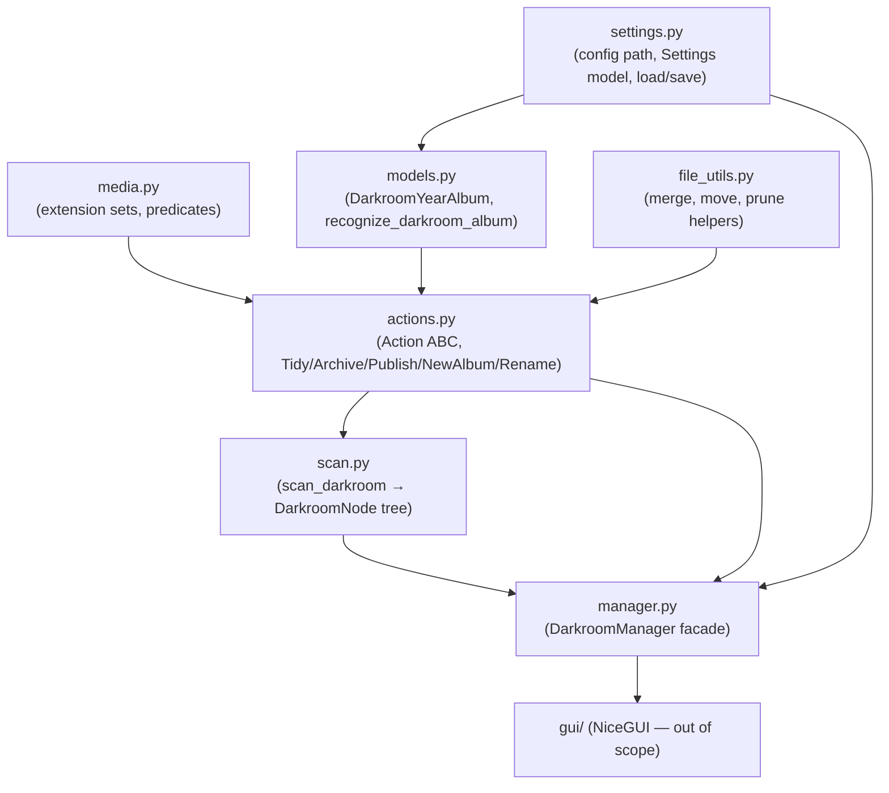
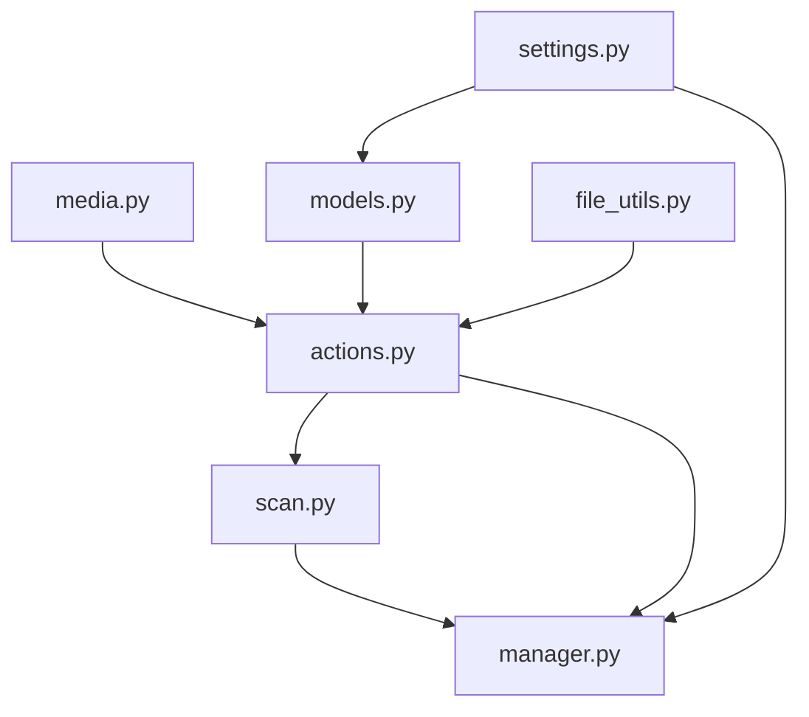

# Test Suite Plan

## Context

### What this project is

`photo-darkroom-manager` is a desktop GUI app (NiceGUI + pywebview) for managing a photographer's local file workflow across three root directories:

- **darkroom** — working folder; albums live at `darkroom/<YYYY>/<YYYY-MM[ name]>/`
- **showroom** — publish destination for finished exports
- **archive** — long-term cold storage

The app scans the darkroom tree and exposes five operations: **Tidy** (move misplaced photos/videos into `PHOTOS/` and `VIDEOS/` subfolders), **Publish** (move exports from `PUBLISH/` to showroom), **Archive** (merge album tree into archive), **New Album** (create folder + `PUBLISH/`), and **Rename**.

### Architecture at a glance




### Why tests are needed now

The implementation is stable enough to test — refactoring volume is expected to drop. The goal is confidence at the lower layers (pure logic + filesystem operations + action workflows) before the GUI layer makes things harder to isolate.

### Testing approach

- **Framework**: `pytest` with `tmp_path` for filesystem isolation; `monkeypatch` for env vars. No test classes — only functions and fixtures.
- **No GUI tests** — `gui/` is NiceGUI and is excluded entirely.
- **Fixture strategy**:
  - `tests/data/` is the canonical fixture tree (committed, realistic album structures). It is **always copied** to `tmp_path` before use — never mutated directly. A shared `data_dir` fixture in `conftest.py` exposes the path; individual tests do `shutil.copytree(data_dir / "darkroom", tmp_path / "darkroom")` (or similar) as needed.
  - `tmp_path` is also used for fully synthetic trees built programmatically within individual tests.
  - Prepare-step assertions that do not call execute may still use a `tmp_path` copy of `tests/data` rather than constructing trees from scratch — but the copy rule applies regardless.
- **Test order**: strictly bottom-up along the dependency graph. No test file imports from a module that hasn't been covered by a prior chunk.
- **Chunked delivery**: one logical group per chunk, each independently committable. **The AI stops after every chunk and waits for the user to run tests and commit before writing the next one.**

---

## Tooling setup (chunk 0 — first commit)

Changes to `[pyproject.toml](pyproject.toml)`:

- Add `pytest` to `[dependency-groups] dev` (no `pytest-mock` — not needed)
- Add `[tool.pytest.ini_options]` section:

```toml
  [tool.pytest.ini_options]
  testpaths = ["tests"]


```

Create `tests/conftest.py` with the shared root fixtures:

```python
@pytest.fixture
def data_dir() -> Path:
    """Path to the committed tests/data tree (read-only source)."""
    return Path(__file__).parent / "data"

@pytest.fixture
def darkroom_root(tmp_path): ...

@pytest.fixture
def showroom_root(tmp_path): ...

@pytest.fixture
def archive_root(tmp_path): ...

@pytest.fixture
def settings(darkroom_root, showroom_root, archive_root): ...
```

Commit: `test: add pytest, configure, add conftest with shared fixtures`.

---

## Test layout

```
tests/
├── conftest.py                          # chunk 0 — shared fixtures (data_dir, roots, settings)
├── data/                                # committed fixture tree — always copied, never mutated
├── test_media.py                        # chunk 1
├── test_settings.py                     # chunk 2
├── test_models.py                       # chunk 3
├── file_utils/                          # chunk 4 — split by concern
│   ├── __init__.py
│   ├── test_prune.py                    # _rmdir_empty_dir, _prune_empty_dirs_under
│   ├── test_merge.py                    # preview_merge_into_archive, merge_tree_into_archive
│   └── test_move.py                     # move_dir_safely, cstm_shutil_move
├── actions/                             # chunks 5–8 — one file per action
│   ├── __init__.py
│   ├── test_tidy.py
│   ├── test_archive.py
│   ├── test_publish.py
│   └── test_new_album_rename.py
├── test_scan.py                         # chunk 9
└── test_manager.py                      # chunk 10
```

`conftest.py` provides the `data_dir` source fixture, three writable root fixtures, and a `settings` fixture. Helper builder functions (plain functions, not fixtures) live inside individual test files to construct album trees from scratch — avoids fixture combinatorial explosion. When using `tests/data` as a source, tests copy the relevant subtree into `tmp_path` before the test body runs.

---

## Layer map




Tests follow this exact order, never testing a module before its dependency. Note: `media.py` has no dependency of its own; `models.py` depends only on `settings.py` (imports `PUBLISH_FOLDER`), not on `media.py`.

---

## Chunks and what each covers

### Chunk 1 — `test_media.py`

- `is_file_a_photo` / `is_file_a_video`: known extensions, upper/mixed case, sidecar alongside photo, empty list, unknown extension
- Parametrized — no filesystem needed

Commit: `test: cover media module`

---

### Chunk 2 — `test_settings.py`

- `get_config_path`: without env var (returns platformdirs path), with env var set (`monkeypatch.setenv`)
- `Settings` validator: existing dir passes, non-existing path raises, file (not dir) raises
- `save_settings` + `load_settings` round-trip via `tmp_path` + env override
- `load_settings` returns `None` when file absent
- `load_settings` with invalid YAML content raises (documents current behavior)

Commit: `test: cover settings module`

---

### Chunk 3 — `test_models.py`

- `DarkroomYearAlbum` validators: valid year+album, non-numeric year → fails, wrong year length → fails, album not matching `YYYY-MM` prefix → fails; values like `2024-13` and `2024-01foo` pass (documenting permissive regex — implementation to be tightened separately)
- `recognize_darkroom_album`: valid 2-part path, deeper subpath (verifies `relative_subpath` is the full relative path), path too shallow → `None`, path outside darkroom → `ValueError`
- `publish_dir` property

Commit: `test: cover models module`

---

### Chunk 4 — `file_utils/` (three files, one commit)

`**test_prune.py**`

- `_rmdir_empty_dir`: empty dir removed, non-empty dir left, already-gone dir is no-op
- `_prune_empty_dirs_under`: bottom-up, leaves files intact, removes empty parent chain

`**test_merge.py**`

- `preview_merge_into_archive`: no conflicts returns all leaves; one duplicate is identified; source not a dir raises `ValueError`
- `merge_tree_into_archive`: moves all files preserving relative structure; source empty dirs cleaned up; stops (moves nothing) when duplicate present; `ArchiveMergeResult` counts correct

`**test_move.py**`

- `move_dir_safely`: happy path, source not exist → `ValueError`, target exists → `ValueError`
- `cstm_shutil_move` tested indirectly through `move_dir_safely` and `merge_tree_into_archive` — no isolated unit tests for this function (it accesses `shutil` privates)

Commit: `test: cover file_utils module`

---

### Chunk 5 — `actions/test_tidy.py`

- `_collect_files_to_tidy` (unit): photo + XMP sidecar grouped together; video; already in `PHOTOS/` → skipped; already in `VIDEOS/` → skipped
- `collect_files_to_tidy`: `PUBLISH` in path → empty; `recursive=True` walks subdirs; skips `PUBLISH` subdir during recursion
- `TidyAction._prepare`: nothing to tidy → `PrepareError`; misplaced files → valid `TidyPlan`; uses `tmp_path` copy of `tests/data` "tidy basic" album
- `TidyAction._execute`: files land in `PHOTOS/` and `VIDEOS/`, count correct
- `TidyAction.prepare` (public wrapper): exception inside `_prepare` → `PrepareError` with traceback in details

Commit: `test: cover tidy action`

---

### Chunk 6 — `actions/test_archive.py`

All tests use `tmp_path` copies of `tests/data` albums — never the source tree directly. This matters because `_prepare` creates parent directories in the archive root (a known side-effect noted in `TODO.md` for future fix).

- `ArchiveAction._prepare`: happy path (album root) → `ArchivePlan` with correct `leaf_count`; duplicate in archive → `PrepareError`; unrecognized path → `PrepareError`
- **Subfolder archive**: path pointing at `darkroom/2026/album/PHOTOS/` → `ArchivePlan` with correct `relative_subpath` (verifies UI-exposed subfolder case)
- `ArchiveAction._execute`: moves files, returns correct count; duplicate at execute time → `ExecutionResult(success=False)`
- Uses `tmp_path` copies of "archive basic success" and "archive will fail on conflict" albums from `tests/data`

Commit: `test: cover archive action`

---

### Chunk 7 — `actions/test_publish.py`

All tests use `tmp_path` copies of `tests/data` albums.

- `PublishAction._prepare`: happy path → `PublishPlan` with empty `conflict_pairs`; conflicts detected → `conflict_pairs` populated; missing `PUBLISH/` → `PrepareError`; empty `PUBLISH/` → `PrepareError`; subdir in `PUBLISH/` → `PrepareError`
- `PublishAction._execute`: files moved to showroom; conflicting dest unlinked then replaced
- Uses `tmp_path` copies of the `tests/data` publish fixture albums for all cases

Commit: `test: cover publish action`

---

### Chunk 8 — `actions/test_new_album_rename.py`

- `NewAlbumAction._execute`: creates `darkroom/year/YYYY-MM name/PUBLISH/` tree; without day; without name; already exists → `ExecutionResult(success=False)`
- `RenameAction._execute`: renames folder; empty name → fails; target name exists → fails; unrecognized album → fails

Commit: `test: cover new album and rename actions`

---

### Chunk 9 — `test_scan.py`

- `_count_files`: photo/video/other counts; `.xmp` counts as "other"
- `_aggregate_stats`: aggregates across children recursively
- `_detect_untidy`: folder with misplaced photos → `True`; tidy folder → `False`
- `_propagate_issues`: child `"untidy"` bubbles to parent and root
- `scan_darkroom` end-to-end: year dirs recognized (4-digit only, not alphabetic); albums matched by `YYYY-MM` pattern; non-matching dirs skipped; `node_type` values correct; stats aggregated at root
- `**PUBLISH/` subtree**: files inside `PUBLISH/` contribute to stats but do not trigger `"untidy"` on the album node (verifies `collect_files_to_tidy` short-circuit for `PUBLISH` paths)

Commit: `test: cover scan module`

---

### Chunk 10 — `test_manager.py`

- `_require_one`: exactly one non-None arg passes; zero or two → `ValueError`
- `_translate_path`: correct path translation across roots
- `darkroom_path`, `showroom_path`, `archive_path`: each with the appropriate kwarg; passing neither or both → `ValueError`
- `rescan()`: sets `tree`, clears `scanning` after completion; `scanning` is `True` during the call (if testable)
- Action factory methods (`tidy_action`, `archive_action`, etc.) return the expected action type with correct paths

Commit: `test: cover manager module`

---

### Chunk 11 (last) — CI test job in `[.github/workflows/ci.yml](.github/workflows/ci.yml)`

Add a `test` job after the existing `typecheck` job — same uv setup, `uv sync --group dev`, then `uv run pytest`. `pytest` is already in dev deps from chunk 0.

Commit: `ci: add pytest test job`

---

## STOP rule for the AI

**After writing each chunk, the AI must stop and wait for confirmation before proceeding to the next chunk.** The user will review, run the tests, and commit. The AI must not speculatively write the next chunk. Each chunk is self-contained and committable on its own.
